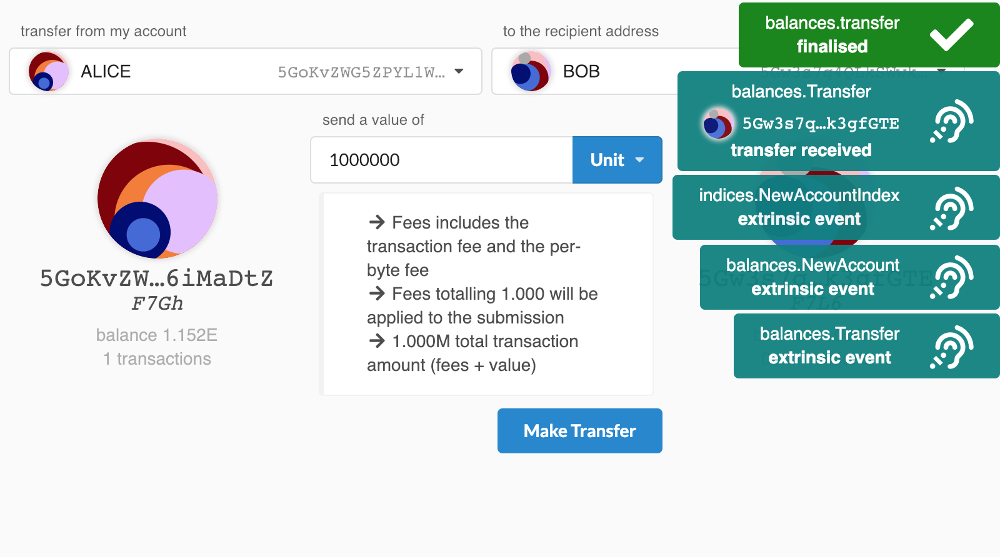

Interacting With Your Node
===

By the end of this tutorial we will have you create your own custom UI to interact with your collectables blockchain. In the meantime, we can use the [Polkadot-JS](https://polkadot.js.org) Apps UI which is a generalized interface that adapts to your custom node.

Open **Chrome** and navigate to:

https://polkadot.js.org/apps/

To point the UI to your local node, you need to adjust the **Settings**:

```
Settings > remote node/endpoint to connect to > Local Node (127.0.0.1:9944)
```


After you press **Save and Reload**, you should notice the Polkadot-JS Apps UI come to life; new tabs such as *Explorer* and *Transfer* should appear.

Let's go into the **Transfer** tab, and make a transaction. The default account named "Alice" is pre-funded with a ton of *Units*.

Share some with "Bob" by creating a transaction. You should see a confirmation appear when the transaction has completed, and Bob's balance will also be updated.



Here you can see just how quickly we set up, ran, and interacted with our own local Substrate chain.

---
**Learn More**

The [Bonds UI](https://github.com/paritytech/substrate-ui) that has been built using the [oo7-substrate library](https://github.com/paritytech/oo7/tree/master/packages/oo7-substrate) is an alternative front-end interface to the [Polkadot-JS Apps UI](https://github.com/polkadot-js/apps) for interacting with your Substrate chain.

When building your own UI, remember to refer to the [Polkadot-JS API Documentation](https://github.com/polkadot-js/api) and the [oo7 API Documentation](https://tomusdrw.github.io/oo7/).
