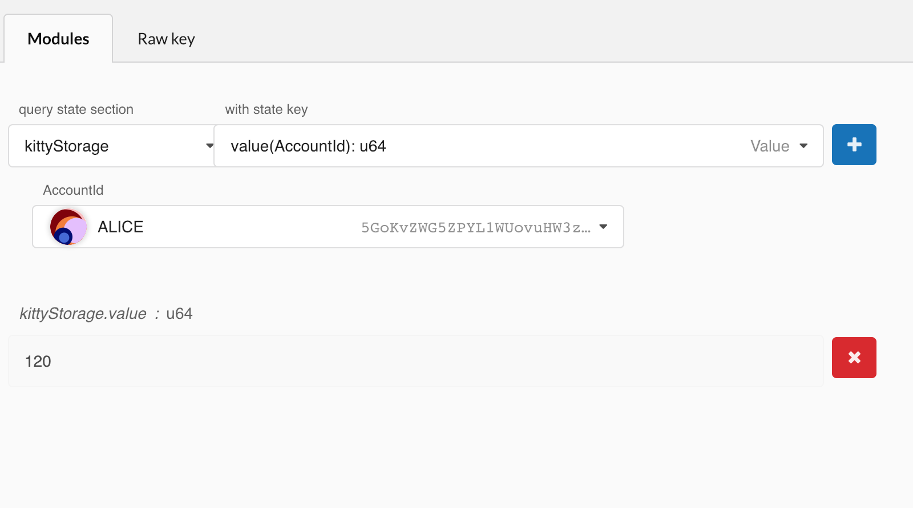

## Checking Our Work in the Polkadot UI

Even though this code should compile without errors, now would be a good time to check out work.

After running:

```
./build.sh
cargo build --release
./target/release/substratekitties purge-chain --dev
```

we can start our node:

```
./target/release/substratekitties --dev
```

If we go back into the [Polkadot UI](https://polkadot.js.org/apps), we should see evidence of our node producing blocks.

## Submit a Transaction

Go to the **Extrinsics** tab, and from the dropdown select:

```
substratekitties > setValue(value)
```

Type in a value and press `Submit Transaction`:


## View the Storage

Now that you have submitted a transaction to put a value into storage, we should take a look that the value is actually there.

Go to the **Chain state** tab, and select:

```
kittyStorage > value(AccountId): u64
```

For the account you submitted the transaction with, query the storage and press the blue `[+]` button:



You should get back the same value you stored in! You can try this with multiple accounts and see that each user is able to store their own value into the runtime storage.