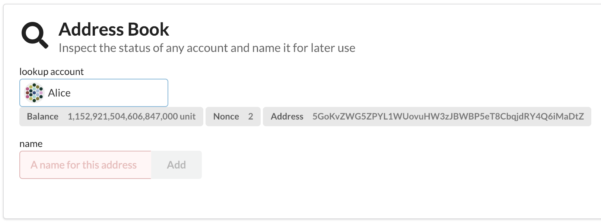
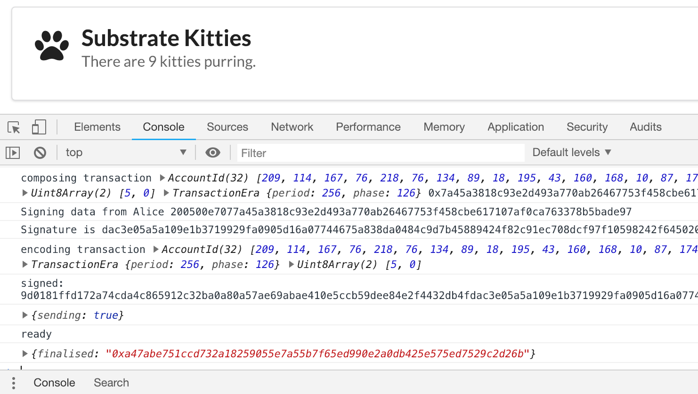

Creating Kitties
===

Now that we have gotten a taste for bonds and accessing runtime storage from our UI, let's actually build some interaction.

## Calling Our Runtime

In the last section we explored the `runtime` variable created by the Substrate UI. Now let's take a look at the `calls` variable:

```
calls.
```


Again, we see that we automatically gain access to all of our modules, including the one we just created. Diving into the `substratekitties` we find:

```
calls.substratekitties.
```


This is a list of all the functions we created in the `decl_module!` macro. Note that our private functions like `_mint()` and `_transfer()` are not here since they are not supposed to be part of our public API.

## Making a Call

So let's try to make a call to create a new kitty. To do that, we can make a `post()` request to our runtime like so:

```javascript
post({
    sender: "5GoKvZWG5ZPYL1WUovuHW3zJBWBP5eT8CbqjdRY4Q6iMaDtZ",
    call: calls.substratekitties.createKitty()
}).tie(console.log)
```

In this sample, the `sender` is the address of one of our accounts. We can retrieve this for any of our accounts in the **Address Book** section of the Substrate UI:



When we submit this in our console, we will see a few things happen in the background, and then our transaction is `finalised` and the number of kitties increases:



## 